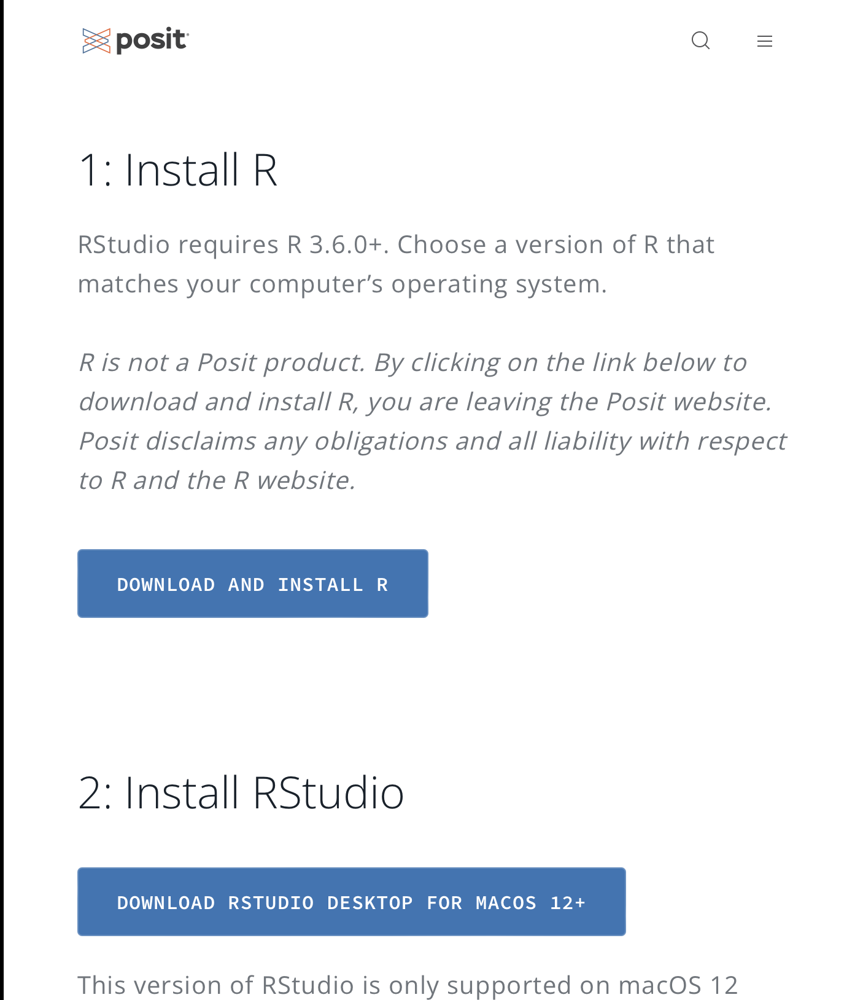
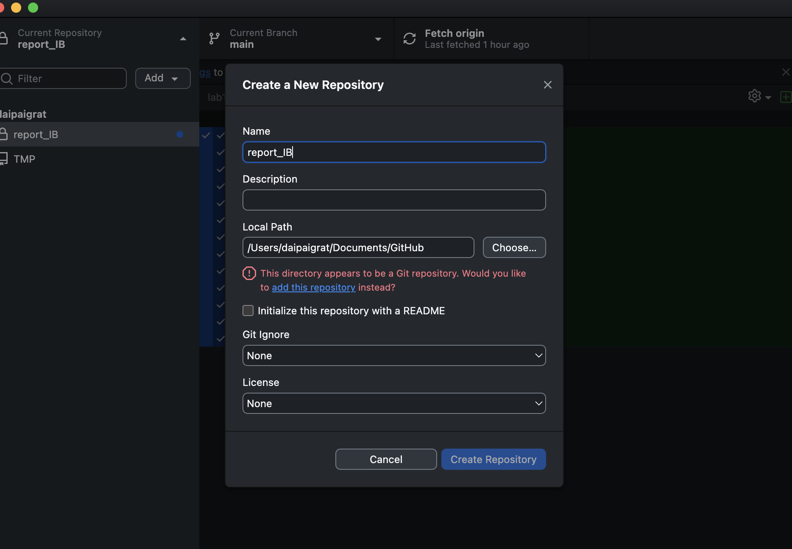
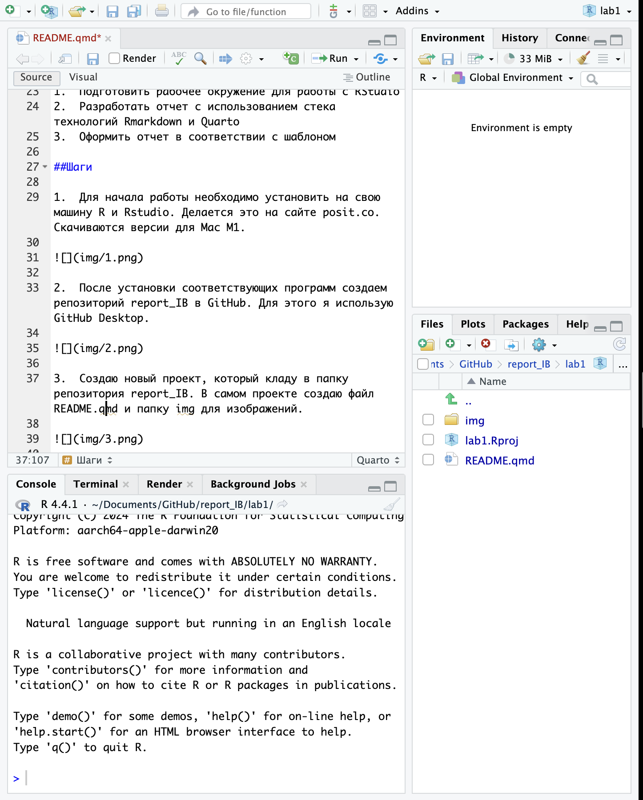
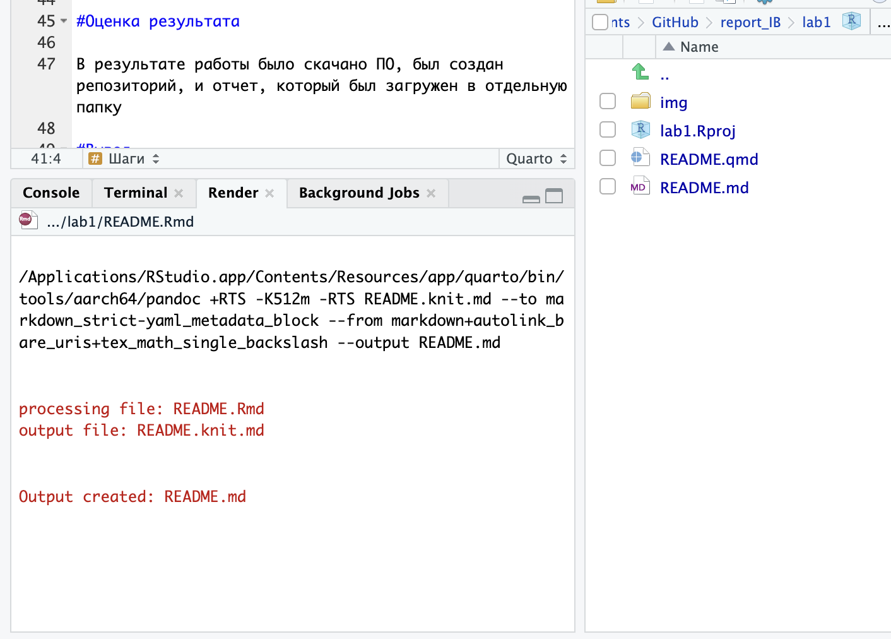

# Подготовка воспроизводимых отчетов

## Цель работы

Развить и закрепить навыки использования современного стека воспроизводимых исследований

## Исходные данные

1.  Программное обеспечение MacOS 14.4.1 Sonoma
2.  Rstudio Desktop
3.  Интерпретатор языка R 4.4.1

## План

1.  Подготовить рабочее окружение для работы с RStudio
2.  Разработать отчет с использованием стека технологий Rmarkdown и Quarto
3.  Оформить отчет в соответствии с шаблоном

## Шаги

1. Для начала работы необходимо установить на свою машину R и Rstudio. Делается это на сайте posit.co. Скачиваются версии для Mac M1.



2. После установки соответствующих программ создаем репозиторий report_IB в GitHub. Для этого я использую GitHub Desktop.



3. Создаю новый проект, который кладу в папку репозитория report_IB. В самом проекте создаю файл README.qmd и папку img для изображений. Отчет также может включать в себя фрагменты кода:

```{r}
print('Hello World!')
```




4. Заканчиваю написание отчета. Сохраняем отчет и рендерим файл посредством кнопки. Создается файл README.md



## Оценка результата

В результате работы было скачано ПО, был создан репозиторий, и отчет, который был загружен в отдельную папку

## Вывод

Мы научились создавать и делать отчет в RStudio, а также загружать работы на GitHub.
