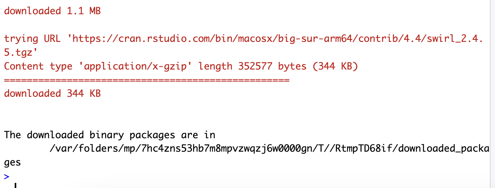
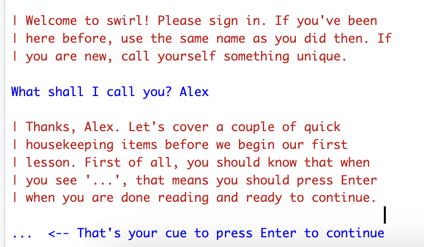
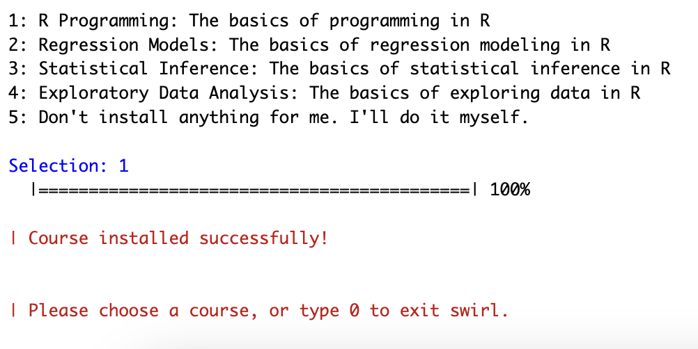
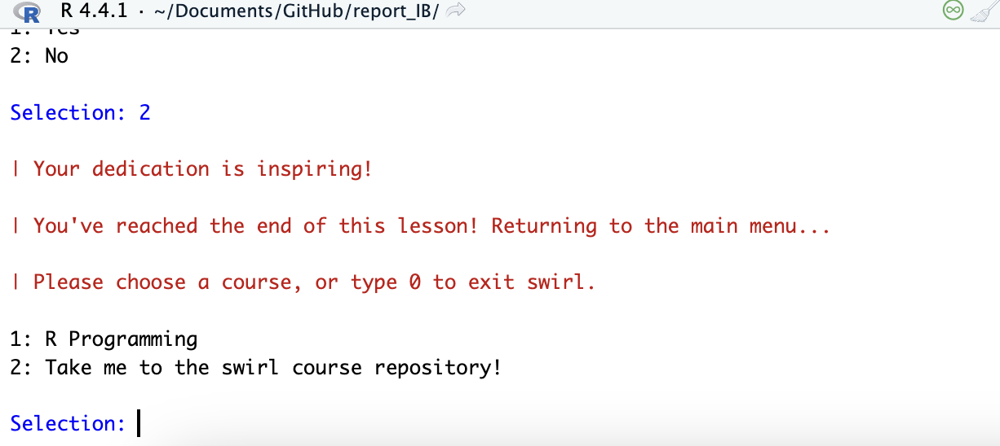
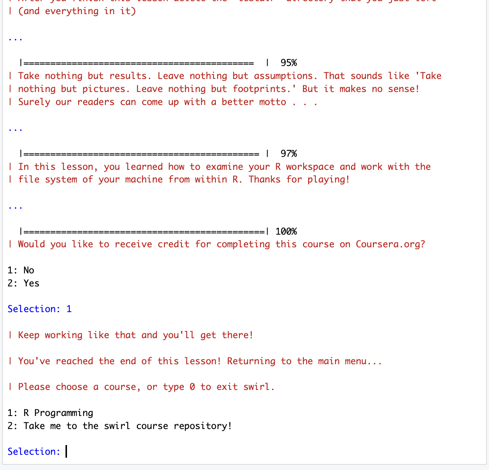
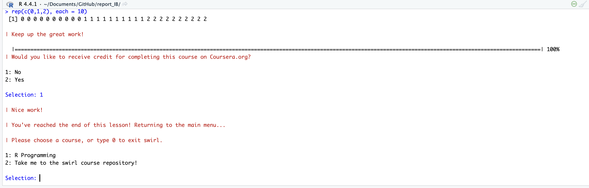
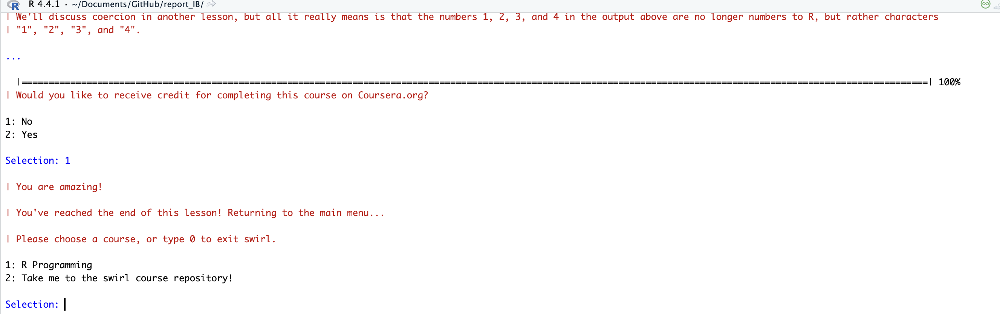
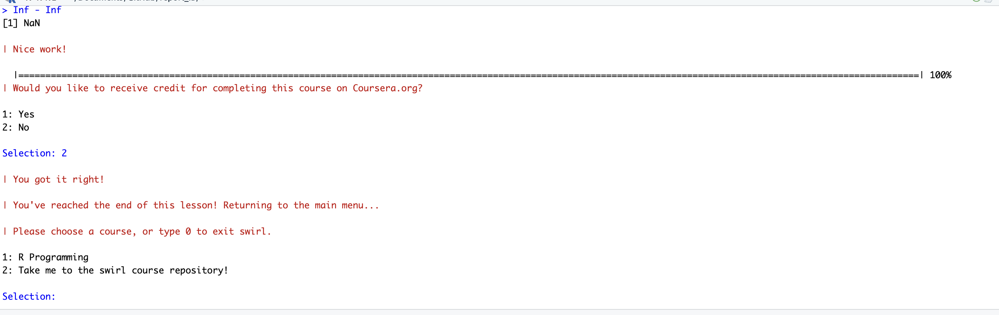

# Работа с языком программирования R
lieless@yandex.ru

# Введение в R

## Цель работы

Развить навыки работы с языком программирования R и закрепить знания
базовых типов данных и операций с ними

## Исходные данные

1.  Программное обеспечение MacOS 14.4.1 Sonoma
2.  Rstudio Desktop
3.  Интерпретатор языка R 4.4.1
4.  Программный пакет swirl

## План

1.  Установить программный пакет swirl
2.  Выполнить подкурсы

## Шаги

1.  Для начала прохождения курса необходимо установить программный пакет
    swirl.

``` r
#install.packages("swirl")
```



1.  Запускаем задания с помощью команды.

``` r
#swirl::swirl()
```



1.  Выбираем из меню курсов “1. R Programming: The basics of programming
    in R”



1.  Запускаем и проходим все требуемые подкурсы.

<!-- -->

1.  Basic Building Blocks



1.  Workspace and Files



1.  Sequences of Numbers



1.  Vectors



1.  Missing Values



## Оценка результата

В результате работы была скачана библиотека swirl и были пройдены 5
модулей курса “R Programming: The basics of programming in R”

## Вывод

Были изучены новые команды и функции языка R. Протренированы
взаимодействия с переменными, векторами, файлами, циклами и NA.
